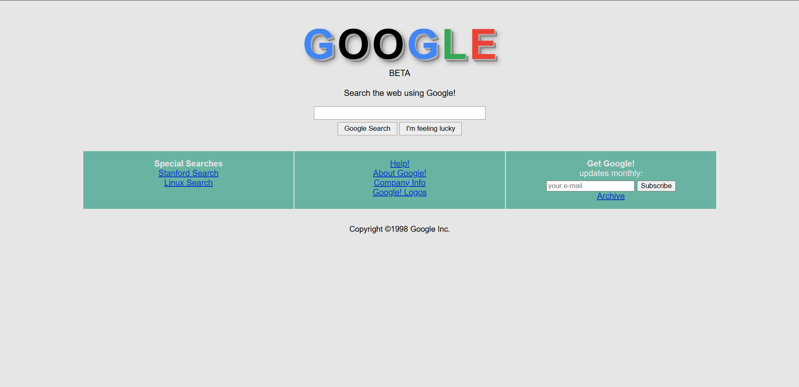

#  Google! BETA (1998 Clone UI)



**Google! BETA** is a nostalgic and minimal web interface inspired by the classic 1998 search engine design.  
It is built using pure **HTML + CSS**.

This project was developed to recreate the original Google design style using modern CSS techniques.

---

##  Preview

Similar to the 1998 Google interface:

- Classic Google logo effect  
- Minimal search area  
- 3-column panel layout  
- Retro UI feel  
- Simple responsive structure  

---

##  Features

✅ Pure HTML & CSS  
✅ Retro / Nostalgic UI Design  
✅ Google-style text shadow logo effect  
✅ Minimal search interface  
✅ Flexible panel layout (Flexbox)  
✅ Clean and simple structure  

---

##  Technologies Used

- HTML5  
- CSS3 (Flexbox + Variables)  
- Text Shadow Effects  


---

##  Color Palette

```
 Purpose  Color 

 Primary (Brand) #E50914
 Background      #0F0F0F 
 Card Background #1A1A1A
 Text            #FFFFFF
```

---

##  Project Structure

```
google-beta/
├── index.html
├── README.md
└── img/
    └── 1.png
```

---

##  Design Details

###  Logo Effect

- Multi-layered `text-shadow` for a 3D text effect  
- Google color palette usage  
- Large typography  

###  Layout

- Centered layout  
- Flexbox panel system  
- Minimal input and button design  

###  Color System

Color structure managed with CSS variables:

```
--bg   → background
--br   → button background
--rg   → border color
--pnl  → panel link color
--hov  → panel background
```

---

##  Installation & Usage

To run the project:

```bash
git clone https://github.com/ChnSari/google-beta.git
```


---

##  Developer

**Cihan Sarı**

* GitHub: https://github.com/ChnSari
* LinkedIn: https://linkedin.com/in/cihansri
* Email: [cihannsri@gmail.com](mailto:cihannsri@gmail.com)

---

##  License

[MIT](https://choosealicense.com/licenses/mit/)

