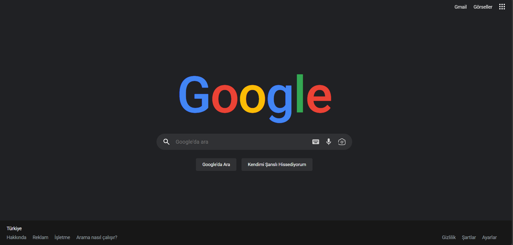

# Google Dark UI Clone



**Google Dark UI Clone** is a modern and minimal web interface inspired by Google's current homepage design.  
It is built using pure **HTML + CSS**.

This project was developed to recreate Google's modern search interface using clean layout techniques and responsive design principles.

---

## Preview

Similar to the modern Google homepage:

- Google colored logo design
- Dark mode interface
- Modern search box UI
- Navigation menu layout
- Action buttons
- Footer section
- Responsive centered layout

---

## Features

✅ Pure HTML & CSS  
✅ Modern Google UI design  
✅ Dark mode interface  
✅ Google color palette logo  
✅ Minimal search interface  
✅ Responsive layout structure  
✅ Flexbox based layout system  
✅ CSS Variables usage  
✅ SVG icon integration  
✅ Clean and simple structure  

---

## Technologies Used

- HTML5  
- CSS3 (Flexbox + Variables)  
- Google Fonts (Roboto)  
- SVG Icons  


---

## Color Palette

* Background #202124
* Primary Text #FFFFFF
* Search Box #303134
* Footer Background #171717
* Secondary Text #9AA0A6
* Google Blue #4285F4
* Google Red #EA4335
* Google Yellow #FBBC05
* Google Green #34A853

---

##  Project Structure

```
google-beta/
├── index.html
├── README.md
└── img/
    └── 1.png
```

---


---

## Design Details

### Logo Design

- Multi-colored Google typography
- CSS color styling for each letter
- Large scale typography

### Layout System

- Centered layout structure
- Flexbox positioning
- Modern UI spacing system
- Responsive container sizing

### Search Interface

- Rounded search box
- SVG icons
- Minimal input design
- Interactive buttons

### Color System

Color structure managed with CSS variables:

* --bg - background
* --rg - text color
* --hr - search / button background
* --row - secondary text color
* --black - footer background

---

##  Installation & Usage

To run the project:

```bash
git clone https://github.com/ChnSari/google-dark-ui.git
```


---

##  Developer

**Cihan Sarı**

* GitHub: https://github.com/ChnSari
* LinkedIn: https://linkedin.com/in/cihansri
* Email: [cihannsri@gmail.com](mailto:cihannsri@gmail.com)

---

##  License

[MIT](https://choosealicense.com/licenses/mit/)
