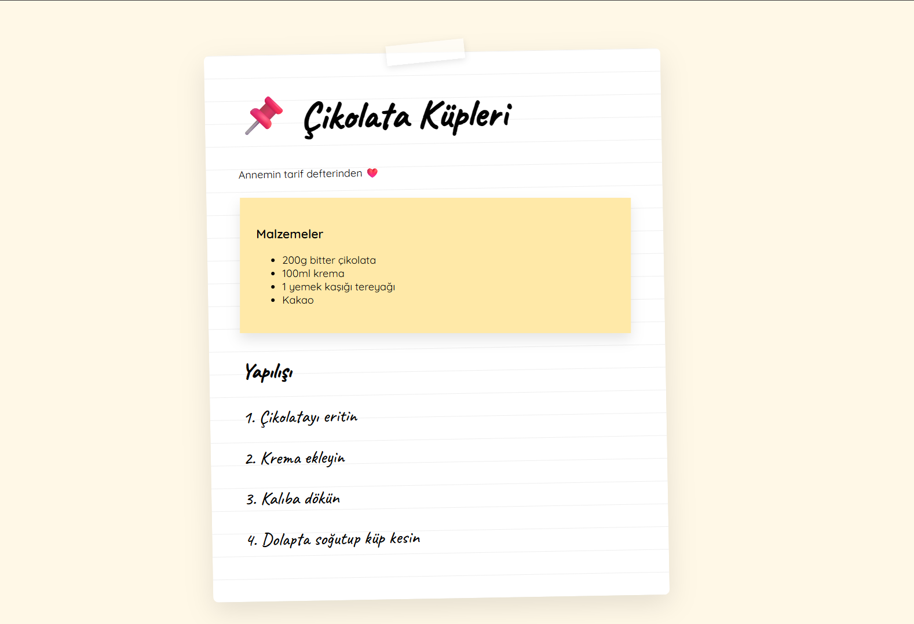

#  Chocolate Cubes — Notebook Style Web Design



A modern, minimal **recipe web page designed with a notebook-style UI**.

This project aims to move recipe pages away from classic blog layouts and provide a warm and friendly experience with a **handwritten / note paper aesthetic**.

---

##  Features

-  Notebook-style design
-  Handwritten font usage (Caveat)
-  Post-it style ingredients card
-  Lined paper effect
-  Minimal and modern UI
-  Responsive design
-  Pure HTML + CSS (no frameworks)

---

##  Design Concept

The project is designed to create the following feel:

- Recipe notebook page
- Paper texture look
- Tape effect
- Handwritten recipe style
- Friendly user experience

---

##  Project Structure

```
melody-market/
├── index.html
├── README.md
└── img/
    └── 1.png
```

---

##  Technologies I Use


---

##  Developer

**Cihan Sarı**

* GitHub: https://github.com/ChnSari
* LinkedIn: https://linkedin.com/in/cihansri
* Email: [cihannsri@gmail.com](mailto:cihannsri@gmail.com)


---

##  Installation

Clone the repository:

```bash
git clone https://github.com/ChnSari/Chocolate-Recipe.git
